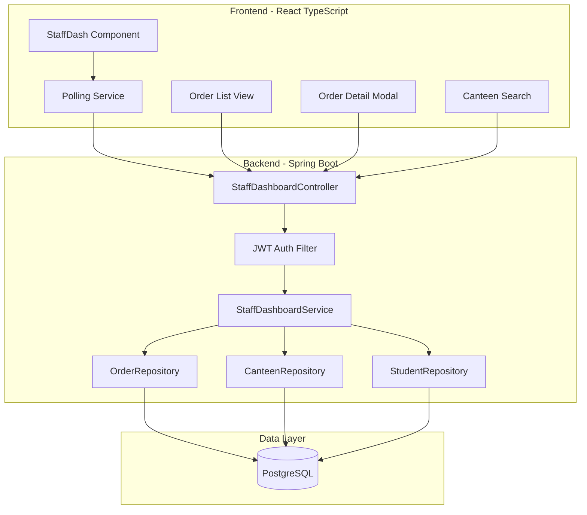

# Design Document: Staff Dashboard Order Integration

## Overview

This design document specifies the technical implementation for integrating real-time order management and canteen search functionality into the staff dashboard. The feature replaces hardcoded order displays with live data from the backend, enabling staff to view, manage, and track student orders in real-time.

The system follows a three-tier architecture:
- **Frontend Layer**: React TypeScript application with polling-based real-time updates
- **Backend Layer**: Spring Boot REST API with JWT authentication
- **Data Layer**: PostgreSQL database with JPA/Hibernate ORM

Key design decisions:
- **Polling over WebSockets**: Given the existing architecture uses REST APIs, we'll implement polling (30-second intervals) for real-time updates rather than introducing WebSocket complexity
- **Stateless Authentication**: JWT tokens in Authorization headers maintain consistency with existing auth patterns
- **Service Layer Pattern**: Order management logic resides in service classes, following the existing StaffDashboardService pattern
- **DTO Pattern**: Data Transfer Objects decouple API contracts from entity models

## Architecture

### System Components



### Data Flow

1. **Order Retrieval Flow**:
   - Frontend initiates polling every 30 seconds
   - Request includes JWT token in Authorization header
   - Backend validates token, extracts canteen ID
   - Service layer queries orders filtered by canteen ID
   - Orders sorted by createdAt descending
   - DTOs returned to frontend with student names resolved

2. **Order Status Update Flow**:
   - Staff selects new status (PREPARING, READY, COMPLETED)
   - Frontend sends PUT request to /staff/orders/{orderId}/status
   - Backend validates ownership (order belongs to staff's canteen)
   - Service updates status and updatedAt timestamp
   - Frontend refreshes order list immediately

3. **Canteen Search Flow**:
   - Staff enters canteen code
   - Frontend sends GET request with canteenCode query parameter
   - Backend searches by canteen code
   - Returns canteen details or 404 if not found

### Authentication & Authorization

- **Authentication**: JWT tokens stored in localStorage, sent in Authorization header as `Bearer {token}`
- **Authorization**: Canteen ID extracted from authenticated user's email, used to filter all queries
- **Security**: All endpoints require authentication; ownership validation prevents cross-canteen access

## Components and Interfaces

### Backend Components

#### 1. StaffDashboardController (Extended)

New endpoints added to existing controller:

```java
@RestController
@RequestMapping("/staff")
@CrossOrigin(origins = {"http://localhost:5173", "http://localhost:3000", "https://main.d2p2ult8kyt0kl.amplifyapp.com"})
public class StaffDashboardController {
    
    // New order management endpoints
    @GetMapping("/orders")
    public ResponseEntity<List<OrderResponse>> getAllOrders(Authentication authentication);
    
    @GetMapping("/orders/{orderId}")
    public ResponseEntity<OrderDetailResponse> getOrderDetail(
        Authentication authentication, 
        @PathVariable UUID orderId);
    
    @PutMapping("/orders/{orderId}/status")
    public ResponseEntity<OrderResponse> updateOrderStatus(
        Authentication authentication,
        @PathVariable UUID orderId,
        @RequestBody OrderStatusUpdateRequest request);
    
    @GetMapping("/orders/filter")
    public ResponseEntity<List<OrderResponse>> filterOrders(
        Authentication authentication,
        @RequestParam(required = false) String status,
        @RequestParam(required = false) @DateTimeFormat(iso = DateTimeFormat.ISO.DATE) LocalDate startDate,
        @RequestParam(required = false) @DateTimeFormat(iso = DateTimeFormat.ISO.DATE) LocalDate endDate);
    
    @GetMapping("/canteen/search")
    public ResponseEntity<CanteenSearchResponse> searchCanteen(
        @RequestParam String canteenCode);
}
```

#### 2. StaffDashboardService (Extended)

New methods added to existing service interface:

```java
public interface StaffDashboardService {
    // Existing methods...
    
    // New order management methods
    List<OrderResponse> getAllOrders(String email);
    OrderDetailResponse getOrderDetail(String email, UUID orderId);
    OrderResponse updateOrderStatus(String email, UUID orderId, String newStatus);
    List<OrderResponse> filterOrders(String email, String status, LocalDate startDate, LocalDate endDate);
    CanteenSearchResponse searchCanteenByCode(String canteenCode);
}
```

#### 3. DTOs

**OrderResponse**:
```java
@Data
@Builder
public class OrderResponse {
    private UUID orderId;
    private String studentName;
    private String items;
    private Double amount;
    private String status;
    private LocalDateTime createdAt;
    private LocalDateTime updatedAt;
}
```

**OrderDetailResponse**:
```java
@Data
@Builder
public class OrderDetailResponse {
    private UUID orderId;
    private UUID studentId;
    private String studentName;
    private String studentEmail;
    private List<OrderItem> items;
    private Double amount;
    private String currency;
    private String status;
    private String paymentMethod;
    private String razorpayOrderId;
    private String razorpayPaymentId;
    private LocalDateTime createdAt;
    private LocalDateTime updatedAt;
}

@Data
@Builder
public class OrderItem {
    private String name;
    private Integer quantity;
    private Double price;
}
```

**OrderStatusUpdateRequest**:
```java
@Data
public class OrderStatusUpdateRequest {
    @NotNull
    private String status; // PREPARING, READY, COMPLETED
}
```

**CanteenSearchResponse**:
```java
@Data
@Builder
public class CanteenSearchResponse {
    private UUID canteenId;
    private String name;
    private String canteenCode;
    private String location;
    private String contactNumber;
    private String email;
}
```

### Frontend Components

#### 1. Order Management Hook

```typescript
interface Order {
    orderId: string;
    studentName: string;
    items: string;
    amount: number;
    status: string;
    createdAt: string;
    updatedAt: string;
}

interface UseOrdersResult {
    orders: Order[];
    loading: boolean;
    error: string | null;
    refreshOrders: () => Promise<void>;
    updateOrderStatus: (orderId: string, status: string) => Promise<void>;
}

const useOrders = (): UseOrdersResult => {
    // Polling logic with 30-second interval
    // Automatic cleanup on unmount
    // Manual refresh capability
}
```

#### 2. Order List Component

```typescript
interface OrderListProps {
    orders: Order[];
    onOrderClick: (orderId: string) => void;
    onStatusUpdate: (orderId: string, status: string) => Promise<void>;
}

const OrderList: React.FC<OrderListProps> = ({ orders, onOrderClick, onStatusUpdate }) => {
    // Renders order rows with status badges
    // Provides status update dropdown
    // Handles click events for detail view
}
```

#### 3. Order Detail Modal

```typescript
interface OrderDetailModalProps {
    orderId: string;
    isOpen: boolean;
    onClose: () => void;
}

const OrderDetailModal: React.FC<OrderDetailModalProps> = ({ orderId, isOpen, onClose }) => {
    // Fetches detailed order information
    // Displays parsed items list
    // Shows payment information
}
```

#### 4. Canteen Search Component

```typescript
interface CanteenSearchProps {
    onSearchResult: (canteen: CanteenSearchResponse) => void;
}

const CanteenSearch: React.FC<CanteenSearchProps> = ({ onSearchResult }) => {
    // Search input field
    // Handles search submission
    // Displays search results or error
}
```

## Data Models

### Order Entity (Existing - No Changes)

The existing Order entity already contains all necessary fields:

```java
@Entity
@Table(name = "orders")
public class Order {
    @Id
    @GeneratedValue(strategy = GenerationType.UUID)
    private UUID orderId;
    
    private UUID studentId;
    private UUID canteenId;
    private String razorpayOrderId;
    private String razorpayPaymentId;
    private String razorpaySignature;
    private Double amount;
    private String currency;
    
    @Enumerated(EnumType.STRING)
    private OrderStatus status;
    
    private String paymentMethod;
    
    @Column(columnDefinition = "TEXT")
    private String items; // JSON string of order items
    
    @CreationTimestamp
    private LocalDateTime createdAt;
    
    private LocalDateTime updatedAt;
    
    public enum OrderStatus {
        CREATED, PENDING, PAID, FAILED, CANCELLED, 
        PREPARING, READY, COMPLETED
    }
}
```

**Note**: The Order entity will be extended to include PREPARING, READY, and COMPLETED status values in the OrderStatus enum.

### Repository Extensions

**Orderrepo** (Extended):
```java
public interface Orderrepo extends JpaRepository<Order, UUID> {
    // Existing methods
    Optional<Order> findByRazorpayOrderId(String razorpayOrderId);
    List<Order> findByCanteenIdAndCreatedAtAfter(UUID canteenId, LocalDateTime startDate);
    List<Order> findByCanteenId(UUID canteenId);
    
    // New methods for filtering
    List<Order> findByCanteenIdAndStatus(UUID canteenId, Order.OrderStatus status);
    List<Order> findByCanteenIdAndCreatedAtBetween(UUID canteenId, LocalDateTime start, LocalDateTime end);
    List<Order> findByCanteenIdAndStatusAndCreatedAtBetween(
        UUID canteenId, 
        Order.OrderStatus status, 
        LocalDateTime start, 
        LocalDateTime end);
}
```

### Data Transformations

**Items Field Parsing**:
The `items` field in the Order entity stores a JSON string. The service layer will parse this into structured OrderItem objects:

```java
private List<OrderItem> parseItems(String itemsJson) {
    try {
        ObjectMapper mapper = new ObjectMapper();
        return mapper.readValue(itemsJson, new TypeReference<List<OrderItem>>() {});
    } catch (JsonProcessingException e) {
        throw new RuntimeException("Failed to parse order items", e);
    }
}
```

**Student Name Resolution**:
The service layer will resolve studentId to student name by querying the Studentrepo:

```java
private String resolveStudentName(UUID studentId) {
    return studentRepo.findById(studentId)
        .map(student -> student.getName())
        .orElse("Unknown Student");
}
```


## Correctness Properties

*A property is a characteristic or behavior that should hold true across all valid executions of a system—essentially, a formal statement about what the system should do. Properties serve as the bridge between human-readable specifications and machine-verifiable correctness guarantees.*

### Property 1: Orders Filtered by Authenticated Canteen

*For any* authenticated staff member and their associated canteen, when retrieving orders, the system should return only orders where the canteenId matches the staff member's canteen, and no orders from other canteens should be included.

**Validates: Requirements 1.1, 2.3**

### Property 2: Order Response Contains Required Fields

*For any* order returned by the API, the response DTO should contain all required fields: orderId, studentName, items, amount, status, createdAt, and updatedAt, with none of these fields being null.

**Validates: Requirements 1.2, 2.4**

### Property 3: Orders Sorted Descending by Creation Time

*For any* list of orders returned by the system, the orders should be sorted in descending order by their createdAt timestamp, such that the most recent order appears first.

**Validates: Requirements 1.4**

### Property 4: All Orders Returned Without Pagination

*For any* canteen with N orders, when a staff member requests all orders, the system should return all N orders without applying pagination limits.

**Validates: Requirements 1.5**

### Property 5: Authentication Required for Order Access

*For any* request to the orders endpoint without a valid JWT token in the Authorization header, the system should reject the request and not return any order data.

**Validates: Requirements 2.2**

### Property 6: Invalid Authentication Returns 401

*For any* request with an invalid, expired, or missing JWT token, the backend should return HTTP 401 Unauthorized status.

**Validates: Requirements 2.5**

### Property 7: Status Update Validation

*For any* status update request, if the new status is not one of PREPARING, READY, or COMPLETED, the system should reject the update and return an error.

**Validates: Requirements 3.4**

### Property 8: Status Update Modifies Timestamp

*For any* successful order status update, both the status field and the updatedAt timestamp should be modified, with updatedAt being set to the current time.

**Validates: Requirements 3.5**

### Property 9: Cross-Canteen Update Returns 403

*For any* authenticated staff member attempting to update an order that belongs to a different canteen, the system should return HTTP 403 Forbidden and not modify the order.

**Validates: Requirements 3.7**

### Property 10: Student Name Resolution

*For any* order with a valid studentId, the system should resolve the studentId to the corresponding student's name, and if the studentId is invalid, should return "Unknown Student".

**Validates: Requirements 4.2**

### Property 11: Items JSON Parsing

*For any* order with a valid JSON string in the items field, parsing the items should produce a structured list of OrderItem objects with name, quantity, and price fields.

**Validates: Requirements 4.3**

### Property 12: Canteen Search Response Completeness

*For any* successful canteen search, the response should contain all required fields: canteenId, name, canteenCode, location, contactNumber, and email.

**Validates: Requirements 5.4**

### Property 13: Non-Existent Canteen Returns 404

*For any* canteen code that does not exist in the database, the search endpoint should return HTTP 404 Not Found with a descriptive error message.

**Validates: Requirements 5.5**

### Property 14: Combined Filtering Works Correctly

*For any* combination of status filter and date range filter, the system should return only orders that match all specified criteria simultaneously (status AND date range).

**Validates: Requirements 7.2, 7.3, 7.4**

### Property 15: Today's Order Count Accuracy

*For any* canteen, the calculated today's order count should equal the actual number of orders created today (since midnight) for that canteen.

**Validates: Requirements 9.1**

### Property 16: Today's Revenue Calculation

*For any* canteen, the calculated today's revenue should equal the sum of amounts from all orders with status PAID or COMPLETED created today.

**Validates: Requirements 9.2**

### Property 17: Growth Percentage Calculation

*For any* canteen with today's and yesterday's data, the growth percentage should be calculated as ((today - yesterday) / yesterday) * 100, handling the case where yesterday's value is zero.

**Validates: Requirements 9.3**

### Property 18: Statistics Reflect Current Data

*For any* request for dashboard statistics, the returned values should reflect the current state of the database at the time of the request, not cached or stale data.

**Validates: Requirements 9.5**

## Error Handling

### Authentication Errors

**401 Unauthorized**:
- Trigger: Missing, invalid, or expired JWT token
- Response: `{"error": "Unauthorized", "message": "Authentication required"}`
- Frontend Action: Clear token, redirect to login

**403 Forbidden**:
- Trigger: Attempting to access/modify orders from another canteen
- Response: `{"error": "Forbidden", "message": "Access denied to this resource"}`
- Frontend Action: Display error message, do not retry

### Validation Errors

**400 Bad Request**:
- Trigger: Invalid status value in update request
- Response: `{"error": "Bad Request", "message": "Status must be one of: PREPARING, READY, COMPLETED"}`
- Frontend Action: Display validation error to user

**400 Bad Request**:
- Trigger: Invalid date format in filter request
- Response: `{"error": "Bad Request", "message": "Invalid date format. Use ISO 8601 format"}`
- Frontend Action: Display validation error to user

### Resource Not Found Errors

**404 Not Found**:
- Trigger: Order ID does not exist
- Response: `{"error": "Not Found", "message": "Order not found"}`
- Frontend Action: Display error message, refresh order list

**404 Not Found**:
- Trigger: Canteen code does not exist
- Response: `{"error": "Not Found", "message": "Canteen not found with code: {code}"}`
- Frontend Action: Display "No results found" message

### Server Errors

**500 Internal Server Error**:
- Trigger: Database connection failure, JSON parsing error, unexpected exceptions
- Response: `{"error": "Internal Server Error", "message": "An unexpected error occurred"}`
- Frontend Action: Display generic error message, provide retry button
- Logging: Log full stack trace with request context

### Network Errors (Frontend)

**Network Timeout**:
- Trigger: Request takes longer than 30 seconds
- Frontend Action: Display timeout message, retry up to 3 times with 5-second delay

**Connection Refused**:
- Trigger: Backend server is down
- Frontend Action: Display "Service unavailable" message, retry up to 3 times

### Error Handling Strategy

1. **Graceful Degradation**: If order fetch fails, display cached orders with warning banner
2. **User Feedback**: All errors display user-friendly messages, not technical stack traces
3. **Retry Logic**: Network errors trigger automatic retry with exponential backoff
4. **Logging**: All errors logged with request ID for debugging
5. **Monitoring**: Error rates tracked in application metrics

## Testing Strategy

### Dual Testing Approach

This feature requires both unit testing and property-based testing for comprehensive coverage:

- **Unit Tests**: Verify specific examples, edge cases, and error conditions
- **Property Tests**: Verify universal properties across all inputs using randomized data

### Unit Testing

**Backend Unit Tests** (JUnit 5 + Mockito):

1. **Controller Tests**:
   - Test endpoint mappings and HTTP methods
   - Test request/response serialization
   - Test authentication integration
   - Example: Verify /staff/orders returns 200 with valid token

2. **Service Tests**:
   - Test business logic with specific examples
   - Test error handling for edge cases
   - Test data transformation logic
   - Example: Verify empty items JSON returns empty list

3. **Repository Tests**:
   - Test custom query methods
   - Test filtering logic with specific data
   - Example: Verify findByCanteenId returns correct orders

4. **Integration Tests**:
   - Test full request/response cycle
   - Test database transactions
   - Test authentication flow
   - Example: Verify end-to-end order status update

**Frontend Unit Tests** (Jest + React Testing Library):

1. **Component Tests**:
   - Test rendering with different props
   - Test user interactions (clicks, form submissions)
   - Test conditional rendering
   - Example: Verify OrderList renders all orders

2. **Hook Tests**:
   - Test polling mechanism
   - Test state management
   - Test error handling
   - Example: Verify useOrders polls every 30 seconds

3. **Integration Tests**:
   - Test component interactions
   - Test API integration with mock server
   - Example: Verify status update triggers refresh

### Property-Based Testing

**Library**: Use **jqwik** for Java property-based testing (integrates with JUnit 5)

**Configuration**: Each property test should run minimum 100 iterations

**Test Tagging**: Each test must reference its design property:
```java
@Property
@Label("Feature: staff-dashboard-order-integration, Property 1: Orders Filtered by Authenticated Canteen")
void ordersFilteredByCanteen(@ForAll("canteens") Canteen canteen, 
                              @ForAll("orders") List<Order> orders) {
    // Test implementation
}
```

**Property Tests to Implement**:

1. **Property 1 - Orders Filtered by Canteen**:
   - Generate: Random canteens, random orders for multiple canteens
   - Test: Verify getAllOrders returns only orders for authenticated canteen
   - Assertion: No orders from other canteens in result

2. **Property 2 - Response Completeness**:
   - Generate: Random orders with all fields populated
   - Test: Convert to OrderResponse DTO
   - Assertion: All required fields present and non-null

3. **Property 3 - Sorting**:
   - Generate: Random orders with random timestamps
   - Test: Retrieve orders and check order
   - Assertion: Each order's createdAt >= next order's createdAt

4. **Property 4 - No Pagination**:
   - Generate: Random number of orders (1 to 1000)
   - Test: Retrieve all orders
   - Assertion: Result size equals total order count

5. **Property 5 & 6 - Authentication**:
   - Generate: Random tokens (valid, invalid, expired, missing)
   - Test: Call endpoint with each token type
   - Assertion: Invalid tokens return 401, valid tokens succeed

6. **Property 7 - Status Validation**:
   - Generate: Random status strings (valid and invalid)
   - Test: Attempt status update with each
   - Assertion: Only PREPARING, READY, COMPLETED accepted

7. **Property 8 - Timestamp Update**:
   - Generate: Random orders and status updates
   - Test: Update status and check timestamps
   - Assertion: updatedAt > original updatedAt

8. **Property 9 - Authorization**:
   - Generate: Random staff members and orders from different canteens
   - Test: Attempt cross-canteen update
   - Assertion: Returns 403, order unchanged

9. **Property 10 - Name Resolution**:
   - Generate: Random studentIds (valid and invalid)
   - Test: Resolve to names
   - Assertion: Valid IDs return names, invalid return "Unknown Student"

10. **Property 11 - JSON Parsing**:
    - Generate: Random valid JSON item strings
    - Test: Parse items field
    - Assertion: Parsed list matches original structure

11. **Property 12 - Search Response**:
    - Generate: Random canteens
    - Test: Search by code
    - Assertion: Response contains all required fields

12. **Property 13 - Not Found**:
    - Generate: Random non-existent canteen codes
    - Test: Search for each
    - Assertion: All return 404

13. **Property 14 - Combined Filtering**:
    - Generate: Random orders, random filter combinations
    - Test: Apply filters
    - Assertion: Results match all filter criteria

14. **Property 15 - Order Count**:
    - Generate: Random orders across multiple days
    - Test: Calculate today's count
    - Assertion: Count equals actual today's orders

15. **Property 16 - Revenue Calculation**:
    - Generate: Random orders with various statuses
    - Test: Calculate today's revenue
    - Assertion: Sum equals PAID + COMPLETED orders

16. **Property 17 - Growth Calculation**:
    - Generate: Random today/yesterday values
    - Test: Calculate growth percentage
    - Assertion: Formula correct, handles zero division

17. **Property 18 - Statistics Freshness**:
    - Generate: Random orders, add new order
    - Test: Fetch statistics before and after
    - Assertion: Statistics change to reflect new order

### Test Coverage Goals

- **Line Coverage**: Minimum 80% for service and controller layers
- **Branch Coverage**: Minimum 75% for conditional logic
- **Property Test Iterations**: Minimum 100 per property
- **Integration Test Coverage**: All API endpoints tested end-to-end

### Testing Tools

**Backend**:
- JUnit 5: Unit test framework
- Mockito: Mocking framework
- jqwik: Property-based testing
- Spring Boot Test: Integration testing
- H2 Database: In-memory database for tests
- RestAssured: API testing

**Frontend**:
- Jest: Test runner
- React Testing Library: Component testing
- MSW (Mock Service Worker): API mocking
- fast-check: Property-based testing for TypeScript

### Continuous Integration

- All tests run on every commit
- Property tests run with 100 iterations in CI
- Integration tests run against test database
- Frontend tests run in headless browser
- Test results published to CI dashboard
- Coverage reports generated and tracked

